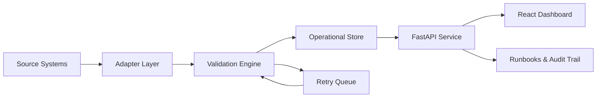

# Bridgewatch

Enterprise integration reliability workspace for validating, monitoring, retrying, and documenting cross-system data flows.

Bridgewatch models the operational surface of a modern IT team: business systems exchange records, validations catch bad data before it reaches downstream users, failed jobs move through a controlled retry queue, and operators get a clear dashboard plus runbooks for common incidents.

## Capabilities

- FastAPI service with authenticated operator endpoints and static dashboard hosting.
- SQLite operational store for source events, integration runs, validation findings, retry queue items, incidents, and audit entries.
- Simulated enterprise adapters for orders, payments, customer profiles, and support tickets.
- Validation engine covering schema requirements, referential checks, duplicate detection, stale-event checks, and downstream readiness.
- Retry controller with exponential backoff, max-attempt policy, blocked-state handling, and incident escalation.
- React dashboard for integration health, open incidents, retry queue state, validation findings, and runbook links.
- Runbooks and architecture decision records for incident handling, security posture, validation strategy, and operating model.
- Unit and API tests covering ingestion, validation, retries, auth, audit logging, and dashboard data contracts.

## Architecture



## Quick Start

```bash
python -m venv .venv
source .venv/bin/activate
pip install -e ".[dev]"
bridgewatch seed
bridgewatch run-once
uvicorn bridgewatch.api:app --reload
```

Open `http://127.0.0.1:8000`.

The default operator API key is for local development only:

```bash
export BRIDGEWATCH_API_KEY=local-operator-key
```

## Docker

```bash
docker compose up --build
```

## CLI Workflow

```bash
bridgewatch reset
bridgewatch seed
bridgewatch run-once
bridgewatch retry
bridgewatch summary
```

## API Surface

| Method | Path | Purpose |
| --- | --- | --- |
| `GET` | `/api/health` | Liveness and store status |
| `GET` | `/api/dashboard` | Dashboard summary, incidents, validations, retries |
| `POST` | `/api/ingest/sample` | Ingest a new simulated event batch |
| `POST` | `/api/integrations/run` | Run validation and routing workflow |
| `POST` | `/api/retries/process` | Process eligible retry queue items |
| `GET` | `/api/runbooks` | List operating runbooks |

Authenticated write endpoints require `X-API-Key`.

## Validation Strategy

Bridgewatch separates validation into five layers:

1. **Shape checks:** required fields, types, event names, and payload structure.
2. **Business rules:** positive payment amounts, valid status values, supported regions, and non-empty owners.
3. **Referential checks:** order/payment/customer linkage and orphaned downstream records.
4. **Freshness checks:** stale timestamps and source-system latency.
5. **Operational checks:** duplicate event IDs, retry attempt limits, blocked incidents, and downstream readiness.

## Project Structure

```text
bridgewatch/
├── bridgewatch/
│   ├── adapters.py
│   ├── api.py
│   ├── auth.py
│   ├── cli.py
│   ├── config.py
│   ├── db.py
│   ├── models.py
│   ├── pipeline.py
│   ├── retry.py
│   └── validation.py
├── static/
│   ├── index.html
│   ├── app.js
│   └── styles.css
├── docs/
│   ├── architecture.md
│   ├── operating-model.md
│   ├── runbooks/
│   └── adr/
├── tests/
└── docker-compose.yml
```

## Design Principles

- **Operational truth over dashboard theater:** every dashboard count comes from persisted integration state.
- **Deterministic failure handling:** retries, escalations, and blocked states are reproducible and test-covered.
- **Documentation as product surface:** runbooks and ADRs are part of the system, not afterthoughts.
- **Security-aware local defaults:** write actions require an API key, and audit entries capture privileged actions.

